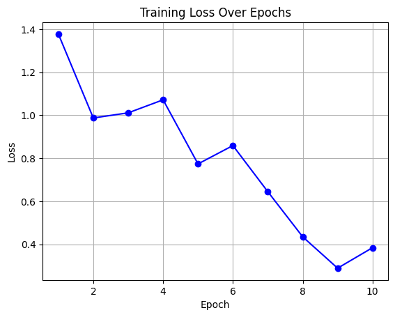
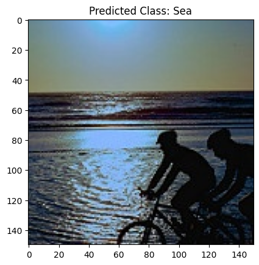
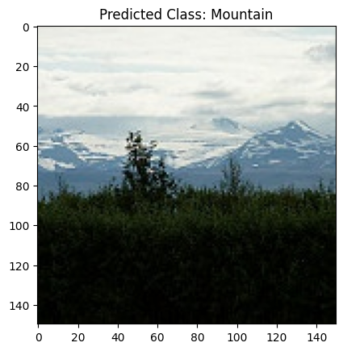
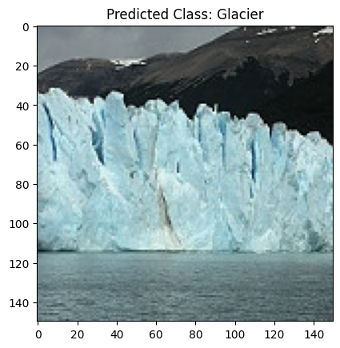
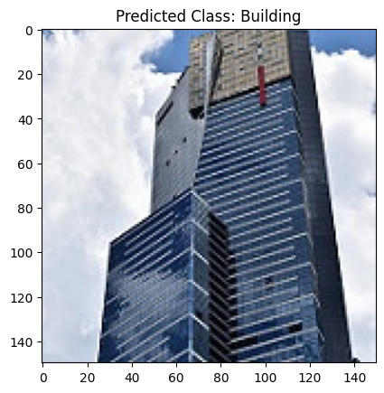
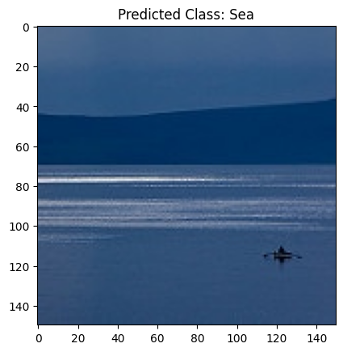
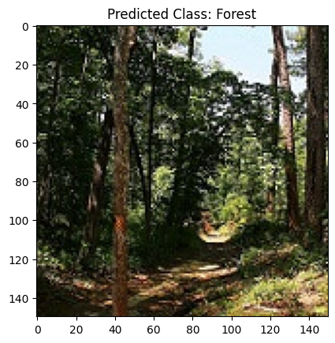

# Image Classification for Landscape Recognition

This project involves the implementation and training of custom convolutional
neural network (CNN) architectures, specifically focusing on a Residual CNN and
an AlexNet model. The goal is to achieve accurate image classification on a
dataset containing diverse scenes such as buildings, forests, glaciers,
mountains, seas, and streets.

## Custom Residual CNN

### Model Architecture

The Residual CNN is designed with a dynamic number of residual blocks and
variable filter sizes. The architecture includes batch normalization,
convolution, dropout, and activation layers. The number of blocks, filter
counts, filter size, activation function, downsampling method, and dropout rate
are configurable parameters.

### Grid Search for Hyperparameters

A grid search is performed to explore different combinations of hyperparameters,
including the number of blocks, channel counts, kernel size, activation
functions, downsampling methods, and dropout probabilities. The goal is to
identify the optimal set of hyperparameters that maximizes validation accuracy.

### Model Training and Validation

The training script includes functions for loading datasets, defining the model
architecture, conducting hyperparameter grid search, and training the model. It
also incorporates a validation loop to evaluate the model's performance on a
separate validation dataset.

## AlexNet Model

### Model Training

The project includes the implementation of training the AlexNet model using
PyTorch. The model is trained on a dataset with specific image transformations
for both training and validation. The training loop includes forward and
backward passes, optimization, and accuracy calculation.

### Plotting Loss Function

The training loss over epochs is visualized using matplotlib to provide insights
into the model's convergence during training.

## Model Evaluation

### Prediction on New Images

A saved model is loaded and evaluated on a set of test images. The model
predictions are displayed alongside the corresponding images, providing a
practical demonstration of the model's classification capabilities.

## Usage

1. Set up the necessary dependencies by installing the required libraries.
2. Download the dataset and adjust the file paths in the provided scripts
   accordingly.
3. Run the training scripts for the custom Residual CNN and AlexNet models.
4. Visualize the training loss using the provided matplotlib script.
5. Evaluate the models on new images using the prediction script.

## Results

After training and evaluation, the project prints and displays key performance
metrics, including accuracy and loss values. The README should include
information about the best hyperparameters and the corresponding model's
accuracy.

